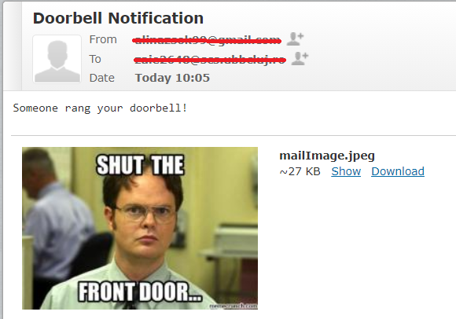

<h1 align="center"> Raspberry Pi Doorbell Notifier </h1> 

<h2 align="left"><u>&#10150; Description: </u></h2>
<p>&nbsp;&nbsp;&nbsp;&nbsp;The main idea of this project is to attach to an existing doorbell a notifier of some sort. The doorbell will be connected to a Raspberry Pi and the notification will be through an email. When the doorbell is rang the raspberry pi will send an email to a specified person.</p>
<p></p>
<h2 align="left">&#10150;<u> Components used :</u></h2>

<ul>
  <li> a Raspberry Pi (I used a <a href="https://www.optimusdigital.ro/ro/placi-raspberry-pi/7195-raspberry-pi-3-model-a-plus.html?search_query=raspberry+pi+3&results=400">Raspberry Pi 3 Model A+)</a></li>
  <li> <a href="https://www.bricodepot.ro/electrice/sisteme-de-securitate/set-wireless-sonerie-si-buton.html">a wireless doorbell </a></li>
  <li> <a href="https://www.optimusdigital.ro/ro/componente-electronice-rezistoare/10928-plusivo-kit-250-buc-rezistoare.html?search_query=rezistoare&results=78"> a 220 R/&#8486; resistor (not needed but just to be sure)</a></li>
  <li> <a href="https://www.optimusdigital.ro/ro/fire-fire-mufate/879-set-fire-mama-tata-10p-30-cm.html?search_query=fire&results=421">2 female to male jumper wires </a></li>
  <li> <a href="https://www.optimusdigital.ro/ro/optoelectronice-led-uri/696-led-rou-de-3-mm-cu-lentile-difuze.html?search_query=led&results=821">a led (not important) </a></li> 
</ul>

<p></p>
<h2> &#10150; Steps to reproduce:</h2>
  
  <div>&#10061; Step 1</div> 
  <p>&nbsp;&nbsp;&nbsp;&nbsp;Open the doorbell and try to find the wires that go into the chime. Some of the doorbells may contain a led there too (that might be a lead too).</p>
  <div>&#10061; Step 2</div> 
  <p>&nbsp;&nbsp;&nbsp;&nbsp;Once you found the wires figure out which one is the anode (-) and the cathode (+). In my case both were marked already. In order to check it up I soldered a red led.</p>
  <div> &#10061; Step 3 </div>
  <p>&nbsp;&nbsp;&nbsp;&nbsp;After that I checked the signal that goes into the led/chime using an multimeter, because my doorbell contains 3 x AA bateries (4.5 V). The signal was lower but I still soldered a resistor to it later, just in case.</p>
  <div> &#10061; Step 4 </div>
  
  <p>&nbsp;&nbsp;&nbsp;&nbsp; As said at the previous step, I soldered a 220R/&#8486; resitior to the anode and after that I soldered the female to male jumper wires, one to the resistor (anode, brown color) and one at the cathode (black color).</p>
  <div> &#10061; Step 5 </div>
  <p>&nbsp;&nbsp;&nbsp;&nbsp; I installed the noobs on the Raspberry Pi and connected to the Wi-Fi. I connected the wires as in the picture below.</p>
  <div align="center">Anode Cathode Setup &nbsp;&nbsp;&nbsp;&nbsp;  ------ &nbsp;&nbsp;&nbsp;&nbsp; Wires + LED soldered &nbsp;&nbsp;&nbsp;&nbsp;</div>
  <div align="center">
  </img>
  </img>
  </div>
  <div> &#10061; Step 6 </div>
  <p>&nbsp;&nbsp;&nbsp;&nbsp; Next I added the doorbell.py file and after that I used the command </p>
  
  ```
  sudo nano /etc/rc.local
  ```
  
  <p>in order to have it run upon booting. At the botton of the file, just above the exit 0 I added the call to our scriptscript.</p>
  
  ```
  python /home/pi/doorbell.py
  ```
  <div> &#10061; Step 7 </div>
  <p>&nbsp;&nbsp;&nbsp;&nbsp; Next I created the file sendNotify.py in which we create and send the email. This script will be called by the main one (doorbell.py)</p>
  
  <div> &#10061; FINAL STEP </div>
  <p>&nbsp;&nbsp;&nbsp;&nbsp; So now you can reboot the Raspberry Pi in order to have the background watching script run and test it by pressing the doorbell knob. If all is setup, you will get an email like this in few seconds: </p>
  <div align="center"></img></div>
  
  <h2> &#10150; Schema:</h2>
  <div align="center"></img></div>
  
  <h2>&#10150; Screenshots: </h2>
  <div align="center"></img></div>
  <div align="center">
  </img>
  </img>
  </div>
  
  <h2>&#10150; Demo, video capture: </h2>
  
  YouTube Video : https://www.youtube.com/watch?v=jfclDxFwJtM
  


